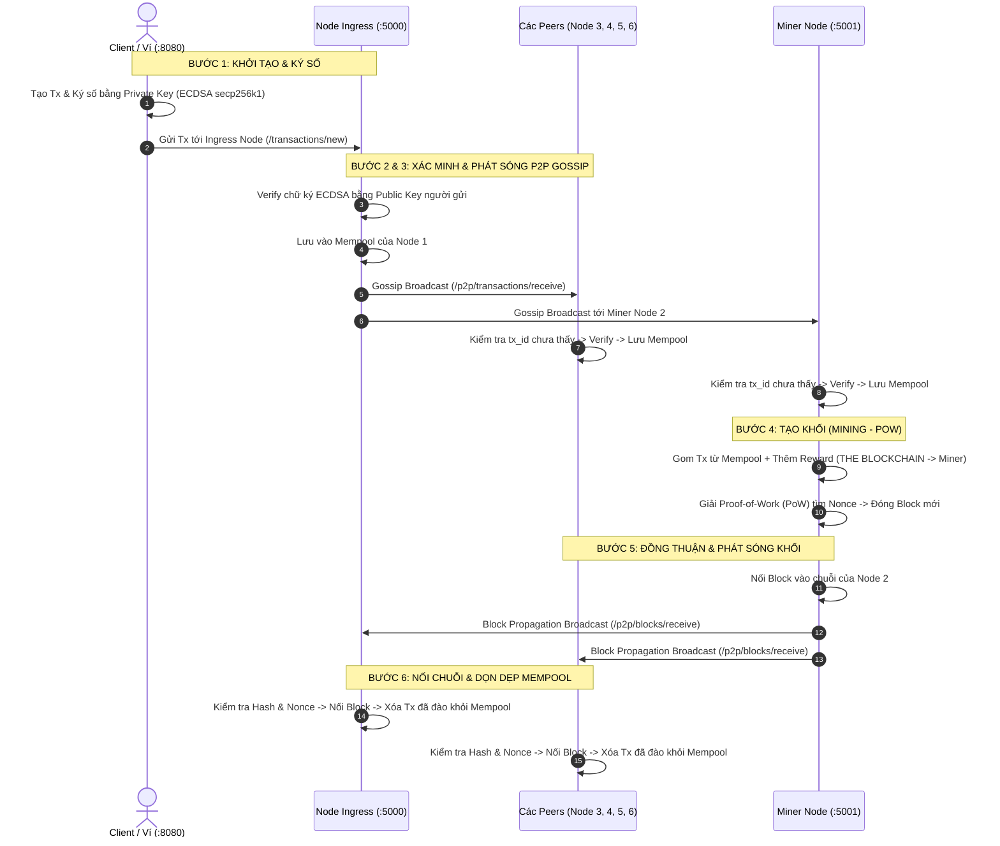

# Blockchain Python P2P Network (Modular Architecture & ECDSA 6-Node Mesh)

> **Dự án nâng cấp hệ thống Blockchain P2P đa Node:** Tái cấu trúc mã nguồn theo kiến trúc module hóa chuyên nghiệp (Zero-Hardcode), chuẩn hóa chu trình **Vòng đời giao dịch (Transaction Lifecycle)** 6 bước tự động, tích hợp mạng ngang hàng P2P Gossip chống bão lặp DoS, cơ chế Auto-Miner & Manual-Miner, xác thực chữ ký số **Elliptic Curve (ECDSA secp256k1)** nghiêm ngặt, hộp đen kiểm toán an ninh thời gian thực (Security Audit Trail) và giao diện trực quan hóa P2P Mesh Visualizer.

---

## 1. Cấu Trúc Mã Nguồn (Codebase Structure)

Mã nguồn được phân tách chức năng độc lập theo nguyên tắc **Separation of Concerns (SoC)**, loại bỏ hoàn toàn hardcode:

```text
blockchain-python-tutorial/
├── blockchain/
│   ├── core/
│   │   ├── crypto.py              # Thẩm định chữ ký số ECDSA (secp256k1), băm SHA-256
│   │   ├── transaction.py         # Data model giao dịch, tính toán tx_id định danh duy nhất
│   │   ├── block.py               # Data model khối, xác minh tính hợp lệ của Proof-of-Work
│   │   ├── ledger.py              # Quản lý Sổ cái (Ledger), Mempool, Thread-safe lock, dọn dẹp Mempool
│   │   └── audit.py               # Hộp đen kiểm toán an ninh thời gian thực (Security Audit Trail)
│   ├── network/
│   │   └── p2p.py                 # Giao thức Gossip lan truyền Tx/Block, Cache chống bão lặp DoS
│   ├── consensus/
│   │   └── miner.py               # Thuật toán PoW, Worker đào khối ngầm & phát sóng khối mới
│   ├── api/
│   │   └── routes.py              # Bộ điều khiển REST API (/status, /transactions, /p2p, /audit/logs)
│   ├── templates/
│   │   ├── index.html             # Dashboard Node với Live Security Audit Trail & Live Sync (2s)
│   │   ├── configure.html         # Trang cấu hình danh sách Peers
│   │   └── visualizer.html        # Giao diện trực quan hóa P2P tích hợp trực tiếp vào Node
│   ├── static/                    # Vendor CSS, Bootstrap, DataTables
│   ├── config.py                  # Xử lý cấu hình qua CLI Flags và file JSON (Zero-Hardcode)
│   ├── server.py                  # Ghép nối các module, khởi chạy Flask đa luồng (threaded=True)
│   └── blockchain.py              # Entrypoint khởi chạy Node (tương thích ngược hoàn toàn)
├── blockchain_client/
│   ├── templates/
│   │   ├── make_transaction.html  # Form chuyển tiền có nạp nhanh Ví Alice/Bob & chọn Node phát sóng
│   │   ├── index.html             # Trình tạo ví ngẫu nhiên (Wallet Generator chuẩn ECDSA)
│   │   └── view_transactions.html # Xem lịch sử giao dịch
├── benchmarks/
│   ├── configs/
│   │   └── benchmark_config.json  # File cấu hình đo lường (Zero-Hardcode)
│   ├── micro_benchmark.py         # Đo lường tầng mật mã (Keygen, Sign, Verify, PK, Sig)
│   ├── macro_benchmark.py         # Đo lường E2E trên mạng 6-Node P2P (TPS, Latency, Block Wire)
│   └── results/                   # Báo cáo kết quả tự động xuất ra CSV & JSON
├── configs/
│   ├── network_6nodes.json        # File cấu hình mẫu mạng lưới P2P Full-Mesh 6 Node
│   └── wallets.json               # Bộ 4 ví người dùng cố định chuẩn ECDSA: Alice, Bob, Charlie, Dave
├── p2p_network_visualizer.html     # Giao diện trực quan hóa P2P mạng 6 Node độc lập
├── start_interactive_network.py   # Launcher khởi chạy 6 Node + 1 Client cho tương tác thực tế
├── start_network.bat              # Script 1-click khởi động toàn bộ mạng trên Windows
└── test_6nodes_simulation.py      # Kịch bản kiểm thử tự động toàn diện mạng 6 Node
```

---

## 2. Chu Trình Vòng Đời Giao Dịch 6 Bước (Transaction Lifecycle)

Toàn bộ luồng xử lý từ khi người dùng khởi tạo đến khi khối được thêm vào chuỗi diễn ra tự động và liên thông giữa các Node:



---

## 3. Bản Chất Kỹ Thuật & Nghiệp Vụ Blockchain Cốt Lõi

### 3.1. Phân Biệt Client (Ví Người Dùng) vs Node (Hạ Tầng Mạng)
- **Client (Port 8080):** Là phần mềm đầu cuối của người dùng. **Chỉ có Client nắm giữ Private Key bí mật** để ký tên đồng ý chuyển tiền. Client tuyệt đối không chuyển Private Key cho bất kỳ ai.
- **Node (Ports 5000-5005):** Là các trạm máy chủ hạ tầng mạng (tương tự trạm ATM/máy chủ ngân hàng). Node không nhận tiền tiêu xài của người dùng; Node chỉ xác thực chữ ký số, lưu sổ cái và duy trì mạng P2P.

### 3.2. Public Key, Private Key & Sender/Recipient Address
- **Public Key:** Là số tài khoản công khai của ví (gắn liền vĩnh viễn với ví cả cuộc đời). Tác giả dùng trực tiếp Public Key làm `Sender Address` và `Recipient Address`.
- **Recipient Address:** Là **Địa chỉ ví của Người Nhận Tiền** (ví dụ ví của Bob), không phải địa chỉ URL của máy chủ Node.
- **Blockchain Node URL:** Mới là địa chỉ máy chủ trung gian (`[http://127.0.0.1:5000](http://127.0.0.1:5000)`) mà Client kết nối tới để nhờ phát sóng gói tin.

### 3.3. Giao Dịch `THE BLOCKCHAIN` (Value 1.0) Là Gì?
- Đây là **Coinbase Transaction (Phần thưởng đào khối - Mining Reward)**.
- Khi Miner bỏ công sức CPU giải bài toán Proof-of-Work, hệ thống tự động sinh ra 1.0 coin mới từ hư vô (`THE BLOCKCHAIN` ➔ `Miner Address`). Đây là cơ chế in tiền tự nhiên của Bitcoin để tạo động lực kinh tế cho thợ đào duy trì mạng.

### 3.4. Cơ Chế Tự Chữa Lành (Self-Healing Fork Resolution)
- Nếu các Node khởi động lệch nhau vài mili-giây dẫn tới mã băm Genesis Block ban đầu khác nhau, khi nhận Block mới có `previous_hash` không khớp đỉnh chuỗi:
  1. Node ban đầu sẽ từ chối nối trực tiếp để bảo vệ tính toàn vẹn.
  2. Ngay sau đó (trong 100ms), thuật toán **Longest Chain Consensus** được kích hoạt: Node tự động kéo chuỗi dài hơn của peer về đè lên chuỗi cũ. Cả mạng lập tức đạt trạng thái đồng thuận tuyệt đối.

### 3.5. Triết Lý Đào Khối Tự Do (Permissionless PoW)
- Trong mô hình Proof-of-Work, **không có ai "cấp quyền" đào coin**. Bất kỳ node nào (kể cả Node 1, 3, 4, 5, 6) nếu bấm nút `Mine` và CPU giải được số Nonce hợp lệ thì khối đó vẫn được toàn mạng công nhận 100% hợp lệ! Việc chỉ định Node 2 làm Miner là để người dùng tiện phân vai quan sát luồng P2P.

---

## 4. Hướng Dẫn Vận Hành & Trải Nghiệm Thực Chiến (Hands-on Demo)

### 4.1. Khởi Động Mạng Lưới (1-Click)
Mở terminal và chạy lệnh:
```powershell
py -3.12 start_interactive_network.py
```
*(Hoặc click đúp file `start_network.bat` trên Windows)*.  
Toàn bộ 6 Node P2P Mesh và 1 Client sẽ được khởi chạy ngầm.

---

### 4.2. Trải Nghiệm Tương Tác Qua Các Tab Trình Duyệt

Mở các tab trình duyệt sau:
- **Tab Client (Ví người dùng):** [`http://localhost:8080/make/transaction`](http://localhost:8080/make/transaction)
- **Tab Node 1 (Ingress Node):** [`http://localhost:5000`](http://localhost:5000)
- **Tab Node 2 (Miner Node ⛏️):** [`http://localhost:5001`](http://localhost:5001)
- **Tab Node 4 (Relay Node):** [`http://localhost:5003`](http://localhost:5003)
- **Tab Visualizer Trực Quan:** [`http://localhost:5000/visualizer`](http://localhost:5000/visualizer)

#### Kịch bản tương tác bạn tự tay thực hiện:
1. **Tại Tab Client (`localhost:8080`):**
   - Khung *Nạp Nhanh Ví Cố Định* đã chọn sẵn: **Người gửi là Alice** và **Người nhận là Bob**. Toàn bộ Public/Private Key đã được tự động điền!
   - Nhập số tiền (ví dụ: `65 COIN`).
   - Bấm **"Generate Transaction"** ➔ Modal mở ra đã chọn sẵn gửi tới **Node 1 (`127.0.0.1:5000`)** ➔ Bấm **"Confirm Transaction"**.
2. **Chuyển sang Tab Node 1 (`localhost:5000`):**
   - Nhờ tính năng **Live Sync (2s)**, bảng Mempool tự động hiện giao dịch `Alice ➔ Bob (65 COIN)`.
   - **Hộp Đen Kiểm Toán (Security Trail)** in dòng: `[CRYPTO] Xac thuc chu ky ECDSA (secp256k1): THANH CONG (VERIFIED)` và `[P2P] Gossip P2P: Phat song giao dich toi 5 peers`.
3. **Chuyển sang Tab Node 4 (`localhost:5003`):**
   - Dù bạn không gửi vào Node 4, Mempool của Node 4 vẫn tự động xuất hiện giao dịch nhờ cơ chế Gossip P2P!
4. **Chuyển sang Tab Node 2 (`localhost:5001` - Miner):**
   - Bạn tự tay bấm nút màu vàng: **"⛏️ Khai Thác Khối (Mine)"**.
   - Node 2 tìm Nonce, đóng Block mới và phát sóng cho toàn mạng.
5. **Quan sát kết quả trên tất cả các Node:**
   - Mempool của cả 6 Node đồng loạt được dọn sạch (`0 tx`).
   - Bảng *Sổ Cái Chuỗi Khối* trên cả 6 Node đồng loạt cập nhật Block mới: hiển thị rõ **Alice đã chuyển 65 coin cho Bob**, kèm 1 dòng thưởng **THE BLOCKCHAIN (Thưởng đào) 1.0 coin** cho Miner!

---

### 4.3. Chạy Kiểm Thử Tự Động (Integration Test Script)
Nếu muốn chạy một bài kiểm thử tự động toàn diện từ A đến Z (kiểm tra 2 vòng gửi coin và đồng bộ chuỗi 100%):
```powershell
py -3.12 test_6nodes_simulation.py
```

---

## 5. Danh Mục Các API RESTful

| Endpoint | Method | Chức năng |
| :--- | :--- | :--- |
| `/status` | `GET` | Lấy thông tin Node: port, role, mempool_count, chain_length, danh sách peers. |
| `/audit/logs` | `GET` | Lấy danh sách lịch sử Hộp Đen Kiểm Toán An Ninh thời gian thực. |
| `/transactions/new` | `POST` | Tiếp nhận giao dịch từ Client, thẩm định chữ ký ECDSA và phát sóng Gossip. |
| `/transactions/get` | `GET` | Lấy danh sách giao dịch đang chờ trong Mempool. |
| `/chain` | `GET` | Lấy toàn bộ lịch sử Sổ Cái Chuỗi Khối. |
| `/mine` | `GET` | Kích hoạt thuật toán PoW đào khối và phát sóng Block mới. |
| `/p2p/transactions/receive` | `POST` | Peer gửi giao dịch qua giao thức Gossip (có lọc chống bão lặp DoS). |
| `/p2p/blocks/receive` | `POST` | Peer phát sóng Block mới vừa đào. |
| `/wallets/sample` | `GET` | Lấy danh sách 4 ví mẫu cố định chuẩn ECDSA (Alice, Bob, Charlie, Dave). |
| `/visualizer` | `GET` | Mở giao diện P2P Mesh Visualizer trực quan hóa trực tiếp từ Node. |

---

## 6. Bộ Đôi Benchmark Hiệu Năng & An Ninh (Micro & Macro Benchmark Suite)

Dự án cung cấp bộ công cụ đo lường thực nghiệm khoa học toàn diện, tương thích đa nền tảng (**Linux, macOS, Windows**) và tuân thủ nguyên tắc **Zero-Hardcode** qua file cấu hình `benchmarks/configs/benchmark_config.json`.

```text
[ Bộ Đôi Benchmark ]
  ├── 1. Micro-Benchmark (Cô lập thuật toán trên CPU): RSA-2048 vs ECDSA (secp256k1) vs ML-DSA-44 (PQC)
  └── 2. Macro-Benchmark (Đo tải mạng 6 Node sống): HTTP Ingestion TPS, Propagation Delay, Block Wire Payload
```

---

### 6.1. Micro-Benchmark: Đo lường chi phí toán học tầng mật mã
Chạy thực nghiệm $1.000$ lần lặp đo thời gian sinh khóa, ký số, xác thực và kích thước byte thô:

```powershell
# Chạy mặc định (1.000 trials):
py -3.12 benchmarks/micro_benchmark.py

# Hoặc tùy biến số lần lặp:
py -3.12 benchmarks/micro_benchmark.py -n 500
```
*(Trên Linux: thay `py -3.12` bằng `python3`)*.

#### Bảng tổng hợp kết quả thực nghiệm Micro-Benchmark ($1.000$ trials):

| Thuật toán | Keygen (ms) | Sign (ms) | Verify (ms) | Public Key | Chữ ký | Kích thước Block (1.000 txs) | Crypto TPS Lý thuyết |
| :--- | :--- | :--- | :--- | :--- | :--- | :--- | :--- |
| **RSA-2048** | $76.362 \pm 75.06$ | $1.833 \pm 1.46$ | **$0.104 \pm 0.09$** | $270\text{ bytes}$ | $256\text{ bytes}$ | $757.81\text{ KB}$ | **$9.615\text{ tx/s}$** |
| **ECDSA (secp256k1)** | $0.803 \pm 0.30$ | $0.866 \pm 0.64$ | $0.734 \pm 0.23$ | **$33\text{ bytes}$** | **$64\text{ bytes}$** | **$338.87\text{ KB}$** | $1.362\text{ tx/s}$ |
| **PQC: ML-DSA-44** | **$0.246 \pm 0.06$** | **$0.569 \pm 0.28$** | $0.129 \pm 0.03$ | $1.312\text{ bytes}$ | $2.420\text{ bytes}$ | $3.888.67\text{ KB}$ | $7.740\text{ tx/s}$ |

> **Phân tích chuyên gia so sánh 3 thế hệ Mật mã:**
> - **Tốc độ tính toán của ML-DSA-44 (Hậu lượng tử):** Sinh khóa cực nhanh ($0.24\text{ ms}$, nhanh nhất trong cả 3 thuật toán), Ký số ($0.56\text{ ms}$) và Xác thực ($0.12\text{ ms}$) đều vượt trội so với ECDSA nhờ cấu trúc đại số ma trận mạng tinh thể (Lattice-based cryptography).
> - **Cái giá phải trả của Hậu lượng tử (Storage Trade-off):** Mặc dù tính toán siêu nhanh và kháng máy tính lượng tử, chữ ký ML-DSA-44 nặng tới **$2.420\text{ bytes}$** (gấp 38 lần ECDSA) và Public Key nặng **$1.312\text{ bytes}$** (gấp 40 lần ECDSA). Điều này khiến kích thước Block phình to lên tới **$3.88\text{ MB}$** cho 1.000 giao dịch (gấp 11.5 lần so với ECDSA $338\text{ KB}$).
> - **Tại sao ECDSA vẫn là tiêu chuẩn vàng của Blockchain truyền thống?** Cân bằng hoàn hảo: Kích thước cực kỳ nhỏ gọn ($33\text{ B}$ PK, $64\text{ B}$ Sig), giảm thiểu nghẽn băng thông và tối ưu hóa chi phí lưu trữ cho hàng triệu node.
> - **Tại sao TPS lý thuyết của RSA và ML-DSA lại cao?** Do RSA sử dụng số mũ công khai nhỏ $e = 65537$, còn ML-DSA sử dụng phép nhân đa thức Number Theoretic Transform (NTT) cực nhanh, giúp thời gian xác thực của Node chỉ mất khoảng $0.1\text{ ms}$. Tuy nhiên, trong mạng P2P thực tế, kích thước gói tin lớn sẽ làm chậm tốc độ truyền tải mạng.

---

### 6.2. Macro-Benchmark: Đo tải thực tế trên mạng phân tán 6 Node sống (HTTP vs HTTPS/TLS)
Tự động kích hoạt mạng 6 Node P2P Mesh (nếu chưa chạy), tạo và ký $N$ giao dịch ECDSA hợp lệ, bắn tải và đo đạc độ trễ lan truyền, so sánh đối đầu chi phí an ninh TLS:

```powershell
# 1. Chạy bài kiểm thử tải mạng mặc định (HTTP Cleartext):
py -3.12 benchmarks/macro_benchmark.py

# 2. Chạy bài kiểm thử bảo mật qua HTTPS (TLS 1.3 / X.509):
py -3.12 benchmarks/macro_benchmark.py --tls

# 3. Chạy chế độ SO SÁNH ĐỐI ĐẦU HTTP vs HTTPS (TLS) tự động:
py -3.12 benchmarks/macro_benchmark.py --compare

# 4. Tùy biến số lượng giao dịch bắn tải:
py -3.12 benchmarks/macro_benchmark.py --compare -n 50
```

#### Bảng tổng hợp kết quả thực nghiệm Macro-Benchmark (HTTP vs HTTPS / TLS 1.3):

| Chỉ số đo lường (Metric) | HTTP (Cleartext) | HTTPS (TLS 1.3) | Chênh lệch / Đánh đổi an ninh |
| :--- | :--- | :--- | :--- |
| **Ingestion TPS** | **$58.30\text{ tx/s}$** | **$9.52\text{ tx/s}$** | Giảm $83.67\%$ do chi phí đàm phán khóa TLS Handshake |
| **Độ trễ tiếp nhận (Mean)** | **$17.06\text{ ms}$** | **$105.05\text{ ms}$** | Tăng thêm $+87.99\text{ ms}$ (RTT Handshake + Encrypt/Decrypt) |
| **Độ trễ tiếp nhận (P95)** | **$29.80\text{ ms}$** | **$149.66\text{ ms}$** | Tăng thêm $+119.86\text{ ms}$ cho các gói đàm phán phiên |
| **Block Propagation Delay** | **$1.722\text{ s}$** | **$1.357\text{ s}$** | Đồng bộ P2P thành công trên toàn bộ 6 Node |
| **Block Wire Payload** | **$2.82\text{ KB}$ (5 txs)** | **$2.82\text{ KB}$ (5 txs)** | Payload ứng dụng đồng nhất ($576.8\text{ bytes/tx}$) |
| **Khả năng kháng tấn công** | Nghe lén, MitM | **Chống MitM, bảo mật đường truyền** | Đảm bảo tính toàn vẹn và bí mật của gói tin |

---

### 6.3. Báo Cáo Dữ Liệu Thô (Raw Export)
Tất cả kết quả đo đạc đều được tự động lưu trữ dưới định dạng `.csv` và `.json` tại thư mục `benchmarks/results/` phục vụ trích xuất đồ thị khoa học:
- `benchmarks/results/RSA_2048_micro_raw.csv`
- `benchmarks/results/ECDSA_secp256k1_micro_raw.csv`
- `benchmarks/results/micro_benchmark_summary.json`
- `benchmarks/results/macro_transactions_http_raw.csv`
- `benchmarks/results/macro_transactions_tls_raw.csv`
- `benchmarks/results/macro_benchmark_http_summary.json`
- `benchmarks/results/macro_benchmark_tls_summary.json`
- `benchmarks/results/macro_benchmark_comparison.json`

