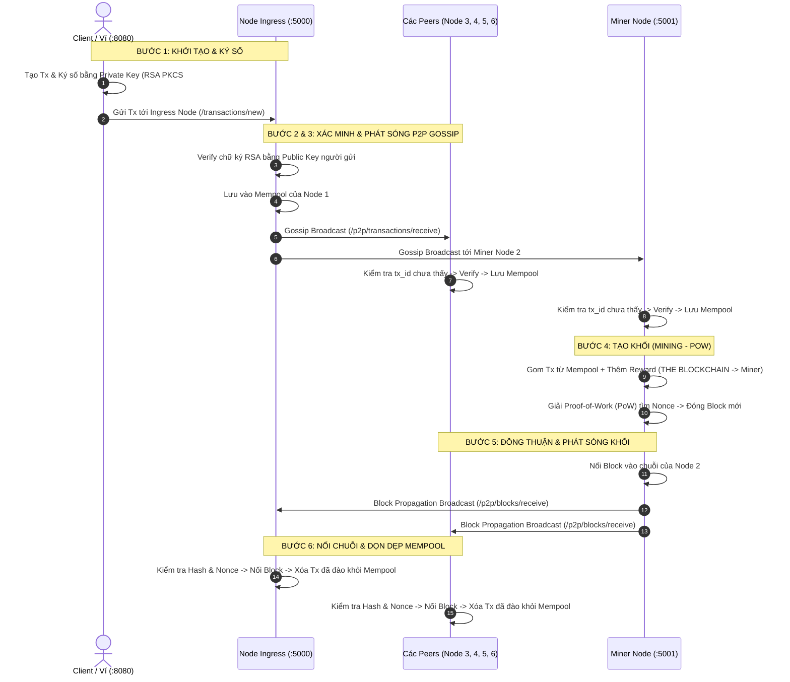

# Blockchain Python P2P Network (Modular Architecture & 6-Node Mesh)

> **Dự án nâng cấp hệ thống Blockchain P2P đa Node:** Tái cấu trúc mã nguồn theo kiến trúc module hóa chuyên nghiệp (Zero-Hardcode), chuẩn hóa chu trình **Vòng đời giao dịch (Transaction Lifecycle)** 6 bước tự động, tích hợp mạng ngang hàng P2P Gossip chống bão lặp DoS, cơ chế Auto-Miner & Manual-Miner, xác thực chữ ký số RSA PKCS#1 v1.5 nghiêm ngặt, hộp đen kiểm toán an ninh thời gian thực (Security Audit Trail) và giao diện trực quan hóa P2P Mesh Visualizer.

---

## 1. Cấu Trúc Mã Nguồn (Codebase Structure)

Mã nguồn được phân tách chức năng độc lập theo nguyên tắc **Separation of Concerns (SoC)**, loại bỏ hoàn toàn hardcode:

```text
blockchain-python-tutorial/
├── blockchain/
│   ├── core/
│   │   ├── crypto.py              # Thẩm định chữ ký số RSA PKCS#1 v1.5, băm SHA-256
│   │   ├── transaction.py         # Data model giao dịch, tính toán tx_id định danh duy nhất
│   │   ├── block.py               # Data model khối, xác minh tính hợp lệ của Proof-of-Work
│   │   ├── ledger.py              # Quản lý Sổ cái (Ledger), Mempool, Thread-safe lock, dọn dẹp Mempool
│   │   └── audit.py               # Hộp đen kiểm toán an ninh thời gian thực (Security Audit Trail)
│   ├── network/
│   │   └── p2p.py                 # Giao thức Gossip lan truyền Tx/Block, Cache chống bão lặp DoS
│   ├── consensus/
│   │   └── miner.py               # Thuật toán PoW, Worker đào khối ngầm & phát sóng khối mới
│   ├── api/
│   │   └── routes.py              # Bộ điều khiển REST API (/status, /transactions, /p2p, /audit/logs)
│   ├── templates/
│   │   ├── index.html             # Dashboard Node với Live Security Audit Trail & Live Sync (2s)
│   │   ├── configure.html         # Trang cấu hình danh sách Peers
│   │   └── visualizer.html        # Giao diện trực quan hóa P2P tích hợp trực tiếp vào Node
│   ├── static/                    # Vendor CSS, Bootstrap, DataTables
│   ├── config.py                  # Xử lý cấu hình qua CLI Flags và file JSON (Zero-Hardcode)
│   ├── server.py                  # Ghép nối các module, khởi chạy Flask đa luồng (threaded=True)
│   └── blockchain.py              # Entrypoint khởi chạy Node (tương thích ngược hoàn toàn)
├── blockchain_client/
│   ├── templates/
│   │   ├── make_transaction.html  # Form chuyển tiền có nạp nhanh Ví Alice/Bob & chọn Node phát sóng
│   │   ├── index.html             # Trình tạo ví ngẫu nhiên (Wallet Generator)
│   │   └── view_transactions.html # Xem lịch sử giao dịch
│   └── blockchain_client.py       # Client sinh cặp khóa RSA (1024-bit), ký số & nạp ví mẫu
├── configs/
│   ├── network_6nodes.json        # File cấu hình mẫu mạng lưới P2P Full-Mesh 6 Node
│   └── wallets.json               # Bộ 4 ví người dùng cố định chuẩn RSA: Alice, Bob, Charlie, Dave
├── p2p_network_visualizer.html     # Giao diện trực quan hóa P2P mạng 6 Node độc lập
├── start_interactive_network.py   # Launcher khởi chạy 6 Node + 1 Client cho tương tác thực tế
├── start_network.bat              # Script 1-click khởi động toàn bộ mạng trên Windows
└── test_6nodes_simulation.py      # Kịch bản kiểm thử tự động toàn diện mạng 6 Node
```

---

## 2. Chu Trình Vòng Đời Giao Dịch 6 Bước (Transaction Lifecycle)

Toàn bộ luồng xử lý từ khi người dùng khởi tạo đến khi khối được thêm vào chuỗi diễn ra tự động và liên thông giữa các Node:



---

## 3. Bản Chất Kỹ Thuật & Nghiệp Vụ Blockchain Cốt Lõi

### 3.1. Phân Biệt Client (Ví Người Dùng) vs Node (Hạ Tầng Mạng)
- **Client (Port 8080):** Là phần mềm đầu cuối của người dùng. **Chỉ có Client nắm giữ Private Key bí mật** để ký tên đồng ý chuyển tiền. Client tuyệt đối không chuyển Private Key cho bất kỳ ai.
- **Node (Ports 5000-5005):** Là các trạm máy chủ hạ tầng mạng (tương tự trạm ATM/máy chủ ngân hàng). Node không nhận tiền tiêu xài của người dùng; Node chỉ xác thực chữ ký số, lưu sổ cái và duy trì mạng P2P.

### 3.2. Public Key, Private Key & Sender/Recipient Address
- **Public Key:** Là số tài khoản công khai của ví (gắn liền vĩnh viễn với ví cả cuộc đời). Tác giả dùng trực tiếp Public Key làm `Sender Address` và `Recipient Address`.
- **Recipient Address:** Là **Địa chỉ ví của Người Nhận Tiền** (ví dụ ví của Bob), không phải địa chỉ URL của máy chủ Node.
- **Blockchain Node URL:** Mới là địa chỉ máy chủ trung gian (`http://127.0.0.1:5000`) mà Client kết nối tới để nhờ phát sóng gói tin.

### 3.3. Giao Dịch `THE BLOCKCHAIN` (Value 1.0) Là Gì?
- Đây là **Coinbase Transaction (Phần thưởng đào khối - Mining Reward)**.
- Khi Miner bỏ công sức CPU giải bài toán Proof-of-Work, hệ thống tự động sinh ra 1.0 coin mới từ hư vô (`THE BLOCKCHAIN` ➔ `Miner Address`). Đây là cơ chế in tiền tự nhiên của Bitcoin để tạo động lực kinh tế cho thợ đào duy trì mạng.

### 3.4. Cơ Chế Tự Chữa Lành (Self-Healing Fork Resolution)
- Nếu các Node khởi động lệch nhau vài mili-giây dẫn tới mã băm Genesis Block ban đầu khác nhau, khi nhận Block mới có `previous_hash` không khớp đỉnh chuỗi:
  1. Node ban đầu sẽ từ chối nối trực tiếp để bảo vệ tính toàn vẹn.
  2. Ngay sau đó (trong 100ms), thuật toán **Longest Chain Consensus** được kích hoạt: Node tự động kéo chuỗi dài hơn của peer về đè lên chuỗi cũ. Cả mạng lập tức đạt trạng thái đồng thuận tuyệt đối.

### 3.5. Triết Lý Đào Khối Tự Do (Permissionless PoW)
- Trong mô hình Proof-of-Work, **không có ai "cấp quyền" đào coin**. Bất kỳ node nào (kể cả Node 1, 3, 4, 5, 6) nếu bấm nút `Mine` và CPU giải được số Nonce hợp lệ thì khối đó vẫn được toàn mạng công nhận 100% hợp lệ! Việc chỉ định Node 2 làm Miner là để người dùng tiện phân vai quan sát luồng P2P.

---

## 4. Hướng Dẫn Vận Hành & Trải Nghiệm Thực Chiến (Hands-on Demo)

### 4.1. Khởi Động Mạng Lưới (1-Click)
Mở terminal và chạy lệnh:
```powershell
py -3.12 start_interactive_network.py
```
*(Hoặc click đúp file `start_network.bat` trên Windows)*.  
Toàn bộ 6 Node P2P Mesh và 1 Client sẽ được khởi chạy ngầm.

---

### 4.2. Trải Nghiệm Tương Tác Qua Các Tab Trình Duyệt

Mở các tab trình duyệt sau:
* **Tab Client (Ví người dùng):** [`http://localhost:8080/make/transaction`](http://localhost:8080/make/transaction)
* **Tab Node 1 (Ingress Node):** [`http://localhost:5000`](http://localhost:5000)
* **Tab Node 2 (Miner Node ⛏️):** [`http://localhost:5001`](http://localhost:5001)
* **Tab Node 4 (Relay Node):** [`http://localhost:5003`](http://localhost:5003)
* **Tab Visualizer Trực Quan:** [`http://localhost:5000/visualizer`](http://localhost:5000/visualizer)

#### Kịch bản tương tác bạn tự tay thực hiện:
1. **Tại Tab Client (`localhost:8080`):**
   - Khung *Nạp Nhanh Ví Cố Định* đã chọn sẵn: **Người gửi là Alice** và **Người nhận là Bob**. Toàn bộ Public/Private Key đã được tự động điền!
   - Nhập số tiền (ví dụ: `65 COIN`).
   - Bấm **"Generate Transaction"** ➔ Modal mở ra đã chọn sẵn gửi tới **Node 1 (`127.0.0.1:5000`)** ➔ Bấm **"Confirm Transaction"**.
2. **Chuyển sang Tab Node 1 (`localhost:5000`):**
   - Nhờ tính năng **Live Sync (2s)**, bảng Mempool tự động hiện giao dịch `Alice ➔ Bob (65 COIN)`.
   - **Hộp Đen Kiểm Toán (Security Trail)** in dòng: `[CRYPTO] Xac thuc chu ky RSA PKCS#1 v1.5: THANH CONG (VERIFIED)` và `[P2P] Gossip P2P: Phat song giao dich toi 5 peers`.
3. **Chuyển sang Tab Node 4 (`localhost:5003`):**
   - Dù bạn không gửi vào Node 4, Mempool của Node 4 vẫn tự động xuất hiện giao dịch nhờ cơ chế Gossip P2P!
4. **Chuyển sang Tab Node 2 (`localhost:5001` - Miner):**
   - Bạn tự tay bấm nút màu vàng: **"⛏️ Khai Thác Khối (Mine)"**.
   - Node 2 tìm Nonce, đóng Block mới và phát sóng cho toàn mạng.
5. **Quan sát kết quả trên tất cả các Node:**
   - Mempool của cả 6 Node đồng loạt được dọn sạch (`0 tx`).
   - Bảng *Sổ Cái Chuỗi Khối* trên cả 6 Node đồng loạt cập nhật Block mới: hiển thị rõ **Alice đã chuyển 65 coin cho Bob**, kèm 1 dòng thưởng **THE BLOCKCHAIN (Thưởng đào) 1.0 coin** cho Miner!

---

### 4.3. Chạy Kiểm Thử Tự Động (Integration Test Script)
Nếu muốn chạy một bài kiểm thử tự động toàn diện từ A đến Z (kiểm tra 2 vòng gửi coin và đồng bộ chuỗi 100%):
```powershell
py -3.12 test_6nodes_simulation.py
```

---

## 5. Danh Mục Các API RESTful

| Endpoint | Method | Chức năng |
| :--- | :--- | :--- |
| `/status` | `GET` | Lấy thông tin Node: port, role, mempool_count, chain_length, danh sách peers. |
| `/audit/logs` | `GET` | Lấy danh sách lịch sử Hộp Đen Kiểm Toán An Ninh thời gian thực. |
| `/transactions/new` | `POST` | Tiếp nhận giao dịch từ Client, thẩm định chữ ký RSA và phát sóng Gossip. |
| `/transactions/get` | `GET` | Lấy danh sách giao dịch đang chờ trong Mempool. |
| `/chain` | `GET` | Lấy toàn bộ lịch sử Sổ Cái Chuỗi Khối. |
| `/mine` | `GET` | Kích hoạt thuật toán PoW đào khối và phát sóng Block mới. |
| `/p2p/transactions/receive` | `POST` | Peer gửi giao dịch qua giao thức Gossip (có lọc chống bão lặp DoS). |
| `/p2p/blocks/receive` | `POST` | Peer phát sóng Block mới vừa đào. |
| `/wallets/sample` | `GET` | Lấy danh sách 4 ví mẫu cố định (Alice, Bob, Charlie, Dave). |
| `/visualizer` | `GET` | Mở giao diện P2P Mesh Visualizer trực quan hóa trực tiếp từ Node. |

---

## 6. Hệ Thống Đo Lường Hiệu Năng & An Ninh Mật Mã (Benchmark Suite)

Hệ thống cung cấp bộ đo lường benchmark độc lập, không hardcode, hỗ trợ môi trường **Windows, Linux (Ubuntu/Kali), macOS**:
* **Micro-Benchmark (`benchmarks/micro_benchmark.py`):** Đo đạc hiệu năng thuần tính toán (Key Generation, Signing, Verification, Public Key Size, Signature Size, Block Overhead, Theoretical TPS) cho 3 thế hệ mật mã: **RSA-2048**, **ECDSA (secp256k1)**, và **ML-DSA-44 (NIST Post-Quantum FIPS 204)**.
* **Macro-Benchmark (`benchmarks/macro_benchmark.py`):** Đo đạc End-to-End hiệu năng mạng lưới 6 Node thực tế (Ingestion TPS, HTTP Latency qua mạng thật, Block Propagation delay và Kích thước Block Wire Payload).
* **Unified Runner (`benchmarks/run_benchmarks.py`):** Trình thực thi tự động hợp nhất.

### 6.1. Hướng Dẫn Chạy Benchmark

```bash
# 1. Chạy toàn bộ cả Micro và Macro Benchmark
python benchmarks/run_benchmarks.py --all

# 2. Hoặc chạy riêng rẽ từng phần:
# Chạy Micro-Benchmark (1.000 trials đo lường mật mã học)
python benchmarks/micro_benchmark.py -n 1000

# Chạy Macro-Benchmark (Bắn tải 30 giao dịch E2E vào mạng 6 Node)
python benchmarks/macro_benchmark.py -n 30
```

### 6.2. Kết Quả Đo Lường Thực Tế (1.000 Trials)

#### Micro-Benchmark: So Sánh 3 Thế Hệ Mật Mã Số
| Thuật toán | Cơ chế toán học | Chuẩn kháng Lượng Tử | KeyGen (ms) | Sign (ms) | Verify (ms) | Public Key | Signature | Kích thước Khối (1.000 txs) | Crypto TPS Lý thuyết |
| :--- | :--- | :---: | :---: | :---: | :---: | :---: | :---: | :---: | :---: |
| **RSA-2048** | Phân tích thừa số nguyên | ❌ Không | 124.64 ms | 3.05 ms | 0.17 ms | 270 B | 256 B | ~758 KB | ~5.952 tx/s |
| **ECDSA (secp256k1)** | Logarithm rời rạc Elliptic Curve | ❌ Không | 1.06 ms | 1.15 ms | 0.99 ms | 33 B | 64 B | ~339 KB | ~1.013 tx/s |
| **ML-DSA-44** | Mạng tinh thể (Module-LWE / Lattice) | ✅ **NIST FIPS 204** | 1.42 ms | 3.34 ms | **0.76 ms** | **1.312 B** | **2.420 B** | **~3.89 MB** | **~1.322 tx/s** |

#### Macro-Benchmark: Mạng Lưới P2P 6-Node E2E (HTTP)
| Chỉ số đo lường thực nghiệm | Kết quả thực tế ML-DSA-44 | Đánh giá Chuyên gia An ninh mạng |
| :--- | :--- | :--- |
| **Tỷ lệ tiếp nhận giao dịch (Success Rate)** | **100% (30/30 txs)** | Ingress Node xác thực chữ ký ML-DSA và xếp hàng Mempool trơn tru. |
| **E2E HTTP Ingestion TPS** | **215.24 tx/s** | Thông lượng tiếp nhận tải HTTP đồng thời. |
| **Độ trễ tiếp nhận (Mean Latency)** | **4.60 ms** (Median: 4.42 ms, P95: 5.91 ms) | Độ trễ mạng Loopback + xác thực PQC. |
| **Đồng bộ khối trên 6 Node (Propagation)** | **4.472 s** (100% đồng bộ) | Miner đóng khối PoW và toàn mạng P2P hoàn tất Nakamoto Consensus. |
| **Dung lượng Wire Payload / Transaction** | **5.150 bytes / tx** (~5.15 KB) | Cao hơn ~6.2 lần so với ECDSA do kích thước khóa và chữ ký PQC lớn. |
